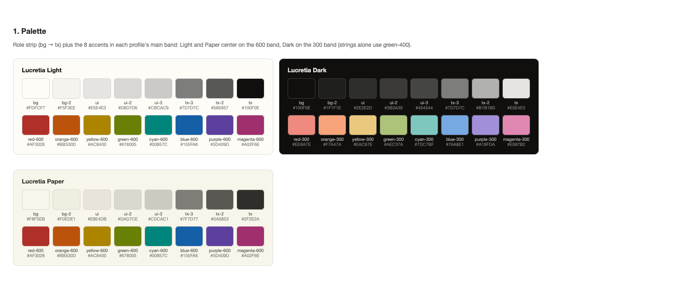
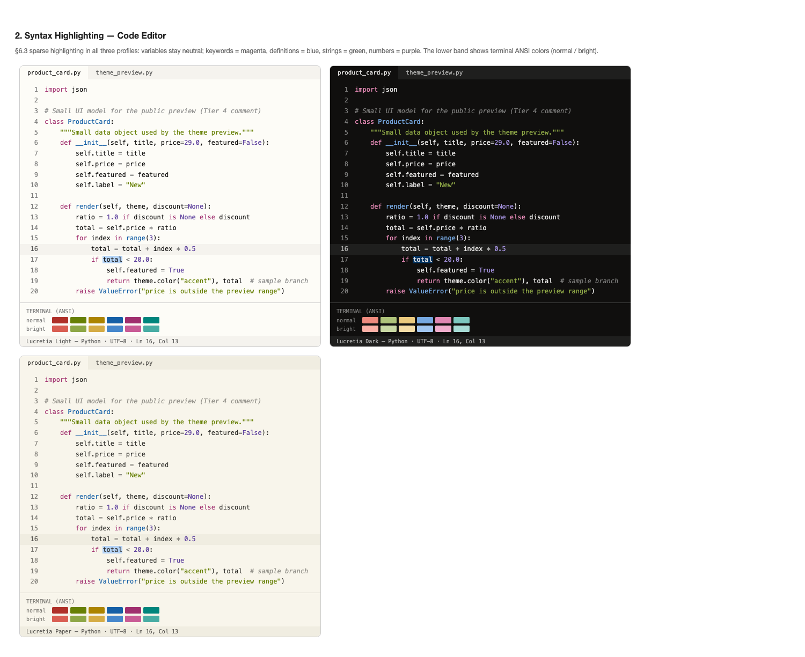
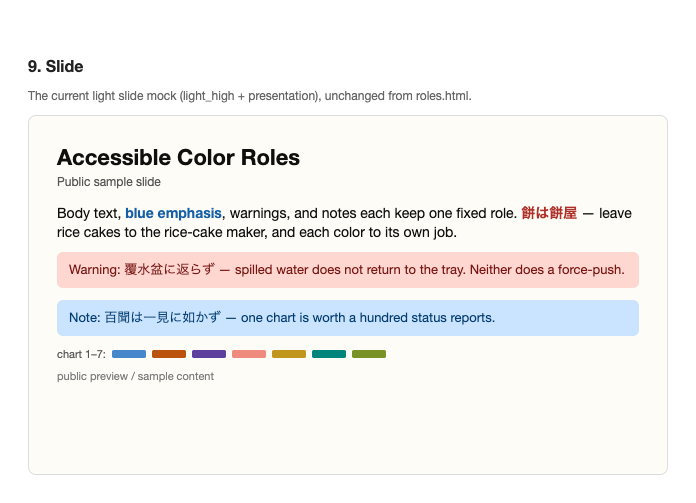

# Lucretia

Lucretia is a custom color theme inspired by [Flexoki](https://stephango.com/flexoki).
It keeps the feeling of ink on paper while moving the background closer to white,
with roles for presentations, Markdown, code editors, and photo-forward web UIs.

The palette stays inside sRGB and is checked with OKLCH, WCAG 2.x, APCA, and CVD simulations.
Final decisions still prioritize how the theme feels in actual reading, projection, code, and image-heavy layouts.

## Preview

Exported from `out/overview.html`.







## Contents

- `palette.json`: generated palette and role mappings
- `out/`: swatches, contrast tables, CVD previews, degradation previews, and usage mockups
- `dist/vscode/`: VS Code / Cursor themes
- `dist/obsidian/`: Obsidian CSS snippet for Lucretia Paper
- `plan.md`: design rationale, evaluation criteria, and decisions

## Try It

Open `out/overview.html` in a browser for a tour of the palette
(base / accents / extended palette / mappings) with side-by-side Light / Dark / Paper
comparisons of the code editor, Markdown, plot, and gallery mockups.
`out/swatches.html`, `out/roles.html`, and `out/paper.html` are the more detailed
review pages for the palette, role mockups, and long-form reading profile.

Install the VS Code / Cursor themes with:

```sh
./scripts/install_editor_theme.sh
```

For Obsidian, copy `dist/obsidian/lucretia-paper.css` into the active profile's
snippets directory and enable it. Desktop and mobile profiles may use separate
Obsidian config folders.

## Details

See [plan.md](plan.md) for the design details.
Development notes, regeneration commands, and current work status live in [DEVELOPMENT.md](DEVELOPMENT.md).

## Attribution

Lucretia is inspired by [Flexoki](https://stephango.com/flexoki) by Steph Ango.
Flexoki is MIT licensed; see [THIRD_PARTY_NOTICES.md](THIRD_PARTY_NOTICES.md).
